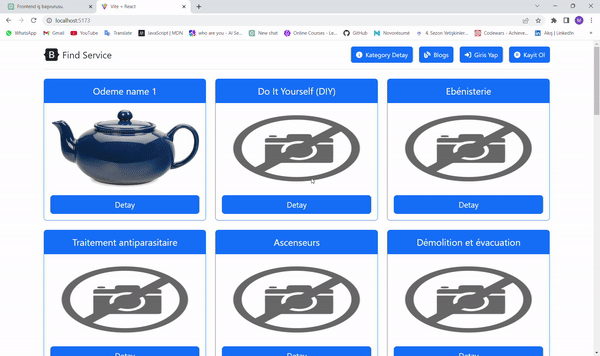

# VITE-SERVICE-APP

This is a React-based web application that utilizes React Toolkit for data management, Context API for token storage, and React Router DOM for page navigation. The app is connected to a real API, and the data is retrieved using Axios. Warning notifications are displayed using React Toastify and SweetAlert libraries, and the project can be launched using npm run dev.

## Features

<ul>
<li>React-based web application</li>
<li>Utilizes React Toolkit for data management</li>
<li>Uses Context API for token storage</li>
<li>Employs React Router DOM for page navigation</li>
<li>Retrieves data using Axios from a real API</li>
<li>Displays warning notifications using React Toastify and SweetAlert libraries</li>
</ul>

## Getting Started

To get started with this project, follow the steps below:

1. Fork the repository to your own GitHub account.
2. Clone the forked repository to your local machine.
3. Create a new branch and make your changes.
4. Push your changes to your forked repository.
5. Submit a pull request to the original repository.

## ScreenGif

The Screen Gif of the project is below:

